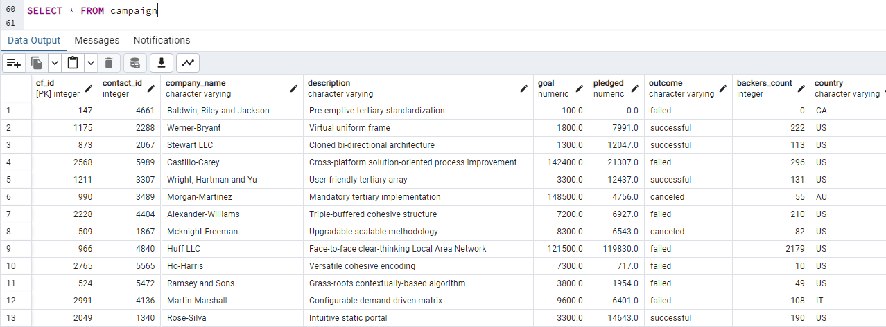
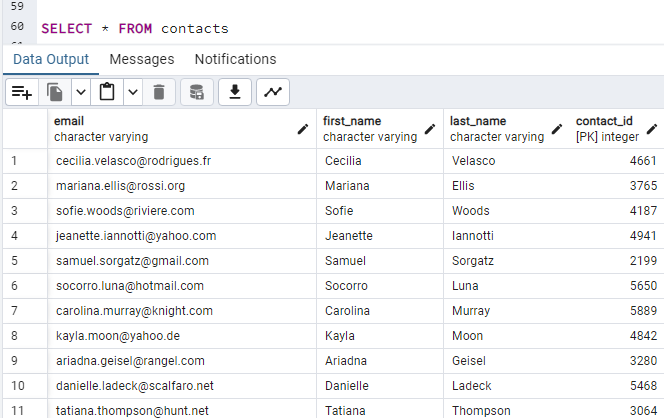
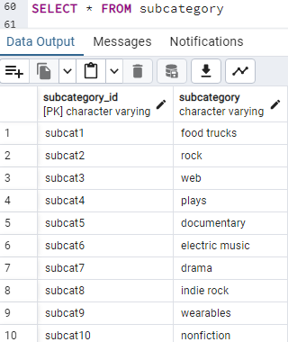
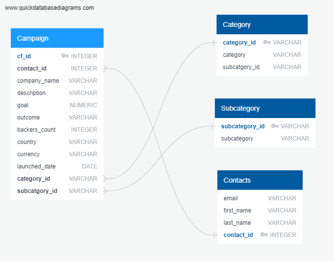

# Crowdfunding_ETL Project 2

 Group 1: Gabby Kruger and Justyn Helgeson
  
## Instructions

We were tasked with building and ETL pipeline using Python, Pandas and Python dictionary methods to transform data. We uploaded our files into a Postgress database to create a unique database. The Instructions for this project are divided into the following subsections and were divided between us as follows:

1. Create the Category and Subcategory DataFrames 
    * Justyn Helgeson
2. Create the Campaign DataFrame
    * Justyn Helgeson
3. Create the Contacts DataFrame 
    * Gabby Kruger
4. Create the Crowdfunding Database
    * Gabby Kruger

## Create the Category and Subcategory DataFrames
1. Extract and transform the crowdfunding.xlsx Excel data to create a category DataFrame that has the following columns:
    * A "category_id" column that has entries going sequentially from "cat1" to "catn", where n is the number of unique categories
    * A "category" column that contains only the category titles
2. Export the category DataFrame as category.csv and save it to your GitHub repository.
3. Extract and transform the crowdfunding.xlsx Excel data to create a subcategory DataFrame that has the following columns:
    * A "subcategory_id" column that has entries going sequentially from "subcat1" to "subcatn", where n is the number of unique subcategories
    * A "subcategory" column that contains only the subcategory titles
4. Export the subcategory DataFrame as subcategory.csv and save it to your GitHub repository.
 

## Create the Campaign DataFrame
1. Extract and transform the crowdfunding.xlsx Excel data to create a campaign DataFrame has the following columns:
    * The "cf_id" column
    * The "contact_id" column
    * The "company_name" column
    * The "blurb" column, renamed to "description"
    * The "goal" column, converted to the float data type
    * The "pledged" column, converted to the float data type
    * The "outcome" column
    * The "backers_count" column
    * The "country" column
    * The "currency" column
    * The "launched_at" column, renamed to "launch_date" and with the UTC times converted to the datetime format
    * The "deadline" column, renamed to "end_date" and with the UTC times converted to the datetime format
    * The "category_id" column, with unique identification numbers matching those in the "category_id" column of the category DataFrame
    * The "subcategory_id" column, with the unique identification numbers matching those in the "subcategory_id" column of the subcategory DataFrame
2. Export the campaign DataFrame as campaign.csv and save it to your GitHub repository.
 

## Create the Contacts DataFrame
1. Our group chose Option 1 to extract and transfrom the data from the contacts.xlsx Excel data using Python dictionary methods. This was completed using the following steps:
    * Import the contacts.xlsx file into a DataFrame.
    * Iterate through the DataFrame, converting each row to a dictionary.
    * Iterate through each dictionary, doing the following:
        * Extract the dictionary values from the keys by using a Python list comprehension.
        * Add the values for each row to a new list.
    * Create a new DataFrame that contains the extracted data.
    * Split each "name" column value into a first and last name, and place each in a new column.
    * Clean and export the DataFrame as contacts.csv and save it to the GitHub repository.

## Create the Crowdfunding Database

1. Inspect the four CSV files, and then sketch an ERD of the tables by using QuickDBDLinks to an external site.
2. Use the information from the ERD to create a table schema for each CSV file.
3. Save the database schema as a Postgres file named crowdfunding_db_schema.sql, and save it to your GitHub repository.
4. Create a new Postgres database, named crowdfunding_db.
5. Using the database schema, create the tables in the correct order to handle the foreign keys.
6. Verify the table creation by running a SELECT statement for each table. This step is documented in the images below:

## Below are screenshots of our tables from the Crowdfunding Database and our ERD 
 

## Campaign Table
  
 
## Category Table

## Contacts Table
  

## Subcategory Table
  

## Crowdfunding ERD
  
 
